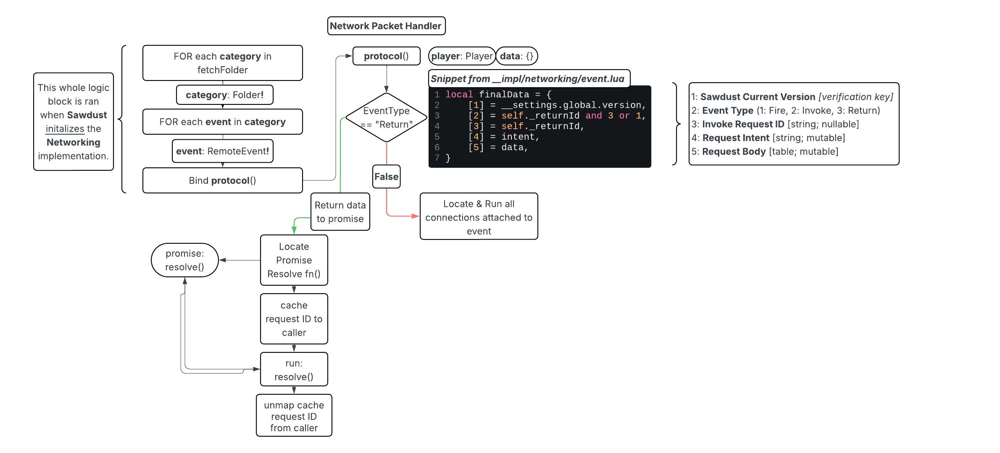

# Networking

Sawdust's **Networking** Implementation is a robust RPC layer abstracted over Roblox RemoteEvents, inspired by the routing of [ExpressJS](https://expressjs.com/) and the request syntax of [Axios](https://axios-http.com/). It enables structured, bidirectional communication between client and server, while removing RemoteEvent boilerplate.

## RPC Layer

When Sawdust initializes this implementation, an initalization script runs that binds each remote in the `fetchFolder` to my custom networking handler, this provides a custom communication channel where you can dynamically send messages back and forth, solely utilizing RemoteEvents.

In the image below, I have mapped out a diagram of the Sawdust Networking Protocol function. The diagram describes the lifecycle, as well as how events are routed. It doesn't go in depth on how connections run, or how events compile and send data.



*Figure: Lifecycle of an event in Sawdust Networking, from initalization, to message handling.*

## Core Concepts

### fetchFolder

This is the folder that **Sawdust** will search to find channels, which will be wrapped, binded to the Sawdust Networking protocol, and cached.

### Event-Sided Awareness

In Sawdust, the **Networking** implementation is designed so that the *same syntax* works on both **client** and **server**.

When we refer to a "side", we mean the *content* in which the event handler or sender is running.

- Server-side: You are in a server script/module. Incoming events come from clients, and you can either respond or reject their events. You can also broadcast to a select few, or globally.
- Client-side: You are in a local script/module. Incoming events come from the server, and you can respond to them, and send events back.

Sawdust does **not** require you to remember seperate APIs for each side, the same call patterns (`:with()`, `:handle()`, `:route()`) work anywhere, the only difference is **who you're talking to.**

### Event Data

Each event has specific data that will be attributed, notably the **intent**, and the **data**.

The **intent** is a *string*, and this will tell the other side what exactly the event you fired is supposed to be doing. This allows you to use one event for a broad variety of things, and have streamlined handlers.

The **data** is a *table*, and this is simply the data that will be passed along to the other side.

### Channel

[*__impl/networking/channel.lua*](https://github.com/Griffin-Dalby/Sawdust/blob/main/src/ReplicatedStorage/Sawdust/__impl/networking/channel.lua)

**"Channels"** are wrapped *Folders* that simply expose all of the remotes that are included in the folder as a **Wrapped Event**, which will be covered in the next section.

Example usage:

```lua
local sawdust = require(game:GetService('ReplicatedStorage').Sawdust)
local networking = sawdust.core.networking

local channel = networking.getChannel('channel_name') --] Provides wrapped channel
local event = channel.event                           --] Provides wrapped event

```

### Events

[*__impl/networking/event.lua*](https://github.com/Griffin-Dalby/Sawdust/blob/main/src/ReplicatedStorage/Sawdust/__impl/networking/event.lua)

**"Events"** are wrapped *RemoteEvents* that provide all of the interface functions, such as the **"Call"** interface accessed by `:with()`, *req* and *res* with `:handle()`, and intent handling with `:route()`.

Example usage:

```lua
local sawdust = require(game:GetService('ReplicatedStorage').Sawdust)
local networking = sawdust.core.networking

local channel = networking.getChannel('channel_name')
channel.event:with() --> Fire-and-Forget
    :intent('intent_string')          --] Set Intent
    :data('argument_1', 'argument_2') --] Set Data
    :fire()

channel.event:with() --> Fire-and-Expect
    :intent('intent_string')
    :data('argument_1', 'argument_2')
    :timeout(2) --] Set timeout time to 2 seconds
    :invoke()   --> Returns a Sawdust Promise
        :andThen(function(data)
            local arg1, arg2 = data[1], data[2]
        end)
        :catch(function(err)
            error(`[{script.Name}] Error occured while invoking event!`)
            error(`[{script.Name}] {err or '<no error message provided>'}`)
        end)
```

### Handling

[*__impl/networking/event.lua*](https://github.com/Griffin-Dalby/Sawdust/blob/main/src/ReplicatedStorage/Sawdust/__impl/networking/event.lua)

**Handling** is an important concept to understand, as this is where the ExpressJS syntax comes in! You can access an **event** the same way you would, then `:handle()` it, which will create a new **connection** to the event, the same way a *RBXScriptConnection* works.

What's special about this, is you'll be provided with a **req** *(request)* object, and a **res** *(response)* object.

With **req**, you can access the **intent** & **data** the event was sent with.

With **res**, you can setup the current side's response, and then eventually **resolve**, or **reject** it.

Example usage:

```lua
local sawdust = require(game:GetService('ReplicatedStorage').Sawdust)
local networking = sawdust.core.networking

local channel = networking.getChannel('channel_name')
channel.event:handle(function(req, res)
    local caller = req.caller :: Player
    local intent = req.intent :: String
    local data = req.data     :: {[number]: any}

    if intent == 'intent_1' then
        res.intent('intent_2')   --] Set response intent
        res.data('argument_1')   --] Set response data
        res.append('argument_2') --] Append to response data

        res.send()               --] Send data to other side
    else
        warn(`[{script.Name}] Player {caller.Name} ({caller.UserId}) attempted to call event w/ invalid intent "{intent}"!`)

        res.data('error message') --] You can use this to pass an error
        res.reject() --] Reject request & send error to other side
    end
end)
```

### Routes

[*__impl/networking/router.lua*](https://github.com/Griffin-Dalby/Sawdust/blob/main/src/ReplicatedStorage/Sawdust/__impl/networking/router.lua)

The router system simply sets up routes for specific **intents**, so when this side receives an event with the specific intent, whatever you write in :on() will be called.

The req/res syntax is the exact same as `:handle()`, as the router is simply an abstraction over the handling system.

Example usage:

```lua
local sawdust = require(game:GetService('ReplicatedStorage').Sawdust)
local networking = sawdust.core.networking

local channel = networking.getChannel('channel_name')

channel.event:route()
    :on('intent_1', function(req, res)
        print(`Player {req.caller.Name} called event w/ intent_1!`)
    end)
    :on('intent_2', function(req, res)
        print(`Plauer {req.caller.Name} called event w/ intent_2 (& data return)`)

        res.intent('intent_2')
        res.data('argument_1', 'argument_2')

        res.send()
    end)
```

### Middleware

