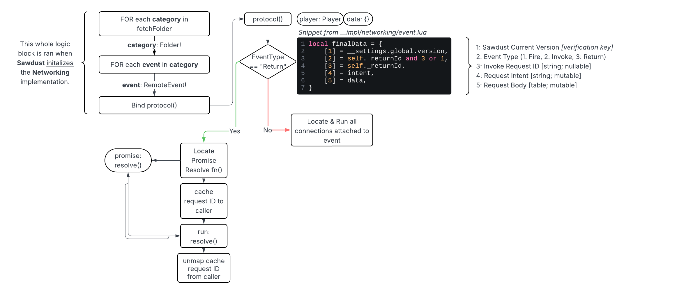

# Networking

I'm personally very proud of this implementation, and I think you'll come to love it as well! It was heavily inspired by Node's [ExpressJS](https://expressjs.com/) module in the way you handle events, as for firing events, I was heavily inspired by Node's [Axios](https://axios-http.com/). Basically, the best of both syntaxes, in a networking suite that can be as simple or advanced as you want.

## RPC Layer

When Sawdust initalizies this implementation, an initalization script runs that binds each remote in the `fetchFolder` to my custom networking handler, this provides a custom communication channel where you can dynamically send messages back and forth, soley utilizing RemoteEvents.

In the image below, I have mapped out a diagram of the Sawdust Networking Protocol function. The diagram describes the lifecycle, as well as how events are routed. It doesn't go in depth on how connections run, or how events compile and send data.

